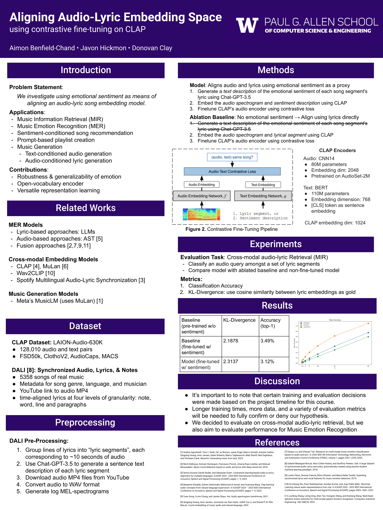

# Audio-Lyric Alignment via Emotional Sentiment
This repository contains the code for the project "Audio-Lyric Alignment via Emotional Sentiment" by Aimon Benfield-Chand, Javon Hickmon, and Donovan Clay. The project is part of the course "CSE-447: Natural Language Processing" at the University of Washington.

## Abstract
In this research, we investigate the feasibility of using emotional sentiment as a method for aligning audio and lyrics in songs, an area that has remained largely unexplored in Music Information Retrieval (MIR) and Music Emotion Recognition (MER). The study utilizes the DALI dataset, comprising over 5000 songs with synchronized audio, lyrics, and notes. Data preparation with DALI involves downloading audio files from YouTube and converting them to WAV format, segmenting songs into ~10 second sections of lyrics and audio, generating text descriptions of each lyrical sections emotional sentiment, and generating log MEL-spectrograms. Our nueral pipeline involves fine-tuning [CLAP](https://ieeexplore.ieee.org/abstract/document/10095889), a CLIP-based model pretrained on 128k audio and text pairs that achieves SOTA performance on zero-shot retrieval and tagging tasks, on our own audio + lyric and audio + emotional-sentiment pairs. This method diverges from traditional fixed-vocabulary sentiment analysis, allowing for more nuanced representation learning. The potential applications of our model are broad, including sentiment-based song search and recommendation and emotion-conditioned music generation.

## Root folder contains:
`scripts`: Contains scripts for fine-tuning  (imported or called by scripts outside this folder). Contains all the key implementations

`Dataset`: Folder for the project's data contents. This includes...
- `DALIDataset.py`: the project's audio-lyric dataset implementation
- `utils`: a folder containing utility functions for audio processing
- `mp4`: a folder of the raw MP4 audio files scraped from YouTube. The name of each audio files is the song's DALI ID. (In the future, we will create an easy-to-run data downloader script and remove the raw audio files to reduce storage overhead)
- `*.json`: JSON files containing metadata for each lyric-description text segment used for fine-tuning CLAP.

`notebooks`: Contains jupyter notebooks of prototyping code, included for reproducibility.

## Results:
Please see out [project report](./report.pdf) for full details on experimental setup and findings.

In addition, we have created a mini poster for brief viewing.

## Authors:
- Aimon Benfield-Chand
- Donovan Clay
- Javon Hickmon
