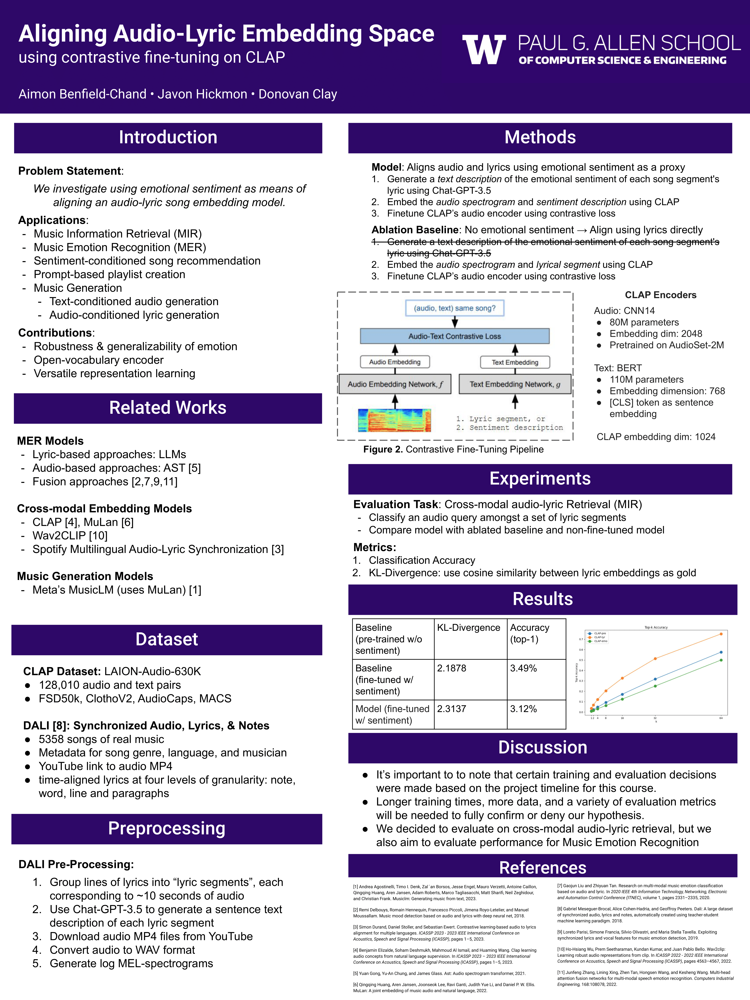

# Audio-Lyric Alignment via Emotional Sentiment

**Is a song's *emotional sentiment* a good enough signal to align its audio with its lyrics? We fine-tuned CLAP to find out — and, honestly, at this scale it wasn't better than the lyrics themselves.**

A UW **CSE 447/517 NLP** study testing whether an LLM-generated *emotional-sentiment description* of a lyric segment is as useful a text signal for audio↔text alignment as the raw lyric. We contrastively fine-tune [CLAP](https://ieeexplore.ieee.org/abstract/document/10095889) (a dual audio/text-encoder model) on the [DALI](https://github.com/gabolsgabs/DALI) dataset and compare three variants on cross-modal **audio→lyric retrieval**.

Authors: Aimon Benfield-Chand, Donovan Clay, Javon Hickmon. 📄 [Full report](report.pdf).

## Abstract

We investigate using emotional sentiment as a proxy for aligning audio and lyrics — an area largely unexplored in Music Information Retrieval (MIR) and Music Emotion Recognition (MER). Using DALI (5,000+ songs with synchronized audio, lyrics, and notes), we prepare data by downloading audio from YouTube, segmenting songs into ~10-second lyric/audio sections, and generating a text description of each lyric section's emotional sentiment with GPT-3.5. We then fine-tune CLAP — a CLIP-style model with dual audio and text encoders — on our own *audio + lyric* and *audio + sentiment-description* pairs, diverging from fixed-vocabulary sentiment analysis to allow more nuanced representation learning. Potential applications include sentiment-based song search and emotion-conditioned music generation.

## Approach

Three models, compared on the same audio→lyric retrieval task:

| Model | Text side of the (audio, text) pair |
|---|---|
| **CLAP-pre** | pretrained CLAP, no fine-tuning (baseline) |
| **CLAP-lyr** | fine-tuned on the raw **lyric** |
| **CLAP-emo** | fine-tuned on the LLM **sentiment description** |

Pipeline: DALI songs → YouTube audio → ~10s lyric segments → GPT-3.5 sentiment description per segment → contrastive fine-tuning of CLAP's audio encoder (text encoder frozen) → audio→lyric retrieval. Both fine-tuning arms are selected by a single `--use_sentiment` flag and run on the same 40,441 English segments.

## Results (honest)

On audio→lyric retrieval, **raw lyrics beat sentiment descriptions** — and the sentiment model underperformed even the un-fine-tuned baseline (top-k accuracy, higher is better):

| Model | Top-1 | Top-2 | Top-4 | Top-8 |
|---|---|---|---|---|
| CLAP-pre (baseline) | 1.18% | 2.44% | 4.76% | 9.20% |
| CLAP-emo (sentiment) | 0.78% | 1.56% | 3.13% | 6.25% |
| **CLAP-lyr (lyrics)** | **3.55%** | **6.85%** | **12.12%** | **20.49%** |

**Why sentiment lost — plus a confound we found.** A sentiment description is a lossy abstraction of the lyric, so it is expectedly worse at retrieving the *exact* lyric. But there's also a real data bug: every generated description shares the same prefix — e.g. *"The lyrics are expressing…"* — which the model can latch onto, deflating the sentiment arm. Fixing this is the first item of future work; sentiment is still expected to help on MER (emotion recognition) rather than exact-lyric retrieval.

<p align="center">
  <a href="poster.pdf"></a>
</p>

## Quickstart

```bash
pip install -e ".[data]"                          # Python 3.10; ffmpeg required on PATH
python scripts/download_data.py --limit 50         # fetch audio (yt-dlp), resumable
python scripts/finetune.py --use_sentiment         # CLAP-emo arm (omit the flag for CLAP-lyr); needs a GPU
python scripts/evaluate.py --model_path model/best_model.pt --use_sentiment
```

## Repository layout

```
Dataset/
  DALIDataset.py     (audio, text) pairs; --use_sentiment picks lyric vs. sentiment
  utils/             audio slicing (ffmpeg), sentiment-description generation, OpenAI batching
  data/              segment metadata JSON + broken_links.txt (raw mp4s are downloaded, not committed)
scripts/
  download_data.py   yt-dlp downloader (replaces the committed media)
  finetune.py        CLAP contrastive fine-tuning
  evaluate.py        audio→lyric retrieval (top-k accuracy, KL divergence)
notebooks/           exploratory prototyping notebooks
report.pdf, poster.pdf
```

## Sample

```
lyric      : "you're my world, the shelter from the rain"
sentiment  : "The lyrics are expressing deep love and dependence on ..."
```

## Future work

- Remove the shared-prefix confound and re-run with recall@k / median-rank over a large candidate pool.
- Evaluate on **MER** (music emotion recognition) — the task where a sentiment abstraction should actually help.
- Benchmark newer audio-text encoders; ship a sentiment→song search demo.

## License

MIT (see [`LICENSE`](LICENSE)). Data: [DALI](https://github.com/gabolsgabs/DALI). CLAP: Elizalde et al., *CLAP: Learning Audio Concepts from Natural Language Supervision* (ICASSP 2023).
